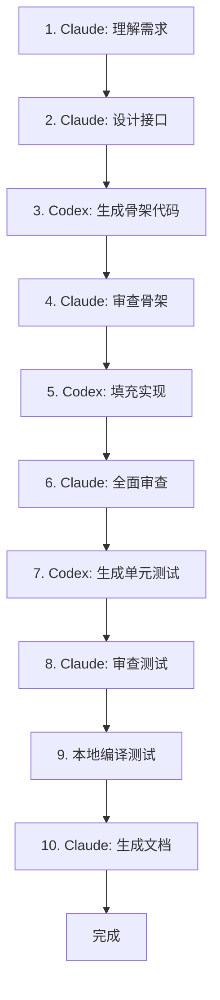

# nndeploy 大型仓库 Vibe Coding 指南

**文档版本**: 1.0
**适用框架**: Claude (Claude Code), GitHub Copilot (Codex)
**项目特点**: C++17, 多模块, 13+ 推理后端, 多设备支持

---

## 一、Vibe Coding 理念

Vibe Coding 是指开发者与 AI 编码助手协作的高效工作模式。核心原则：

| 原则 | 说明 |
|------|------|
| **信任验证** | 信任 AI 的能力，但必须验证关键逻辑 |
| **渐进增强** | 从小任务开始，逐步建立信任 |
| **上下文管理** | 精准提供上下文，避免信息过载 |
| **架构一致** | 严格遵循项目既定架构模式 |

---

## 二、Claude vs Codex 适用场景

### 2.1 Claude 优势场景

| 场景 | 原因 |
|------|------|
| 架构设计 | 强大的理解和规划能力 |
| 代码重构 | 能理解大范围代码关系 |
| 文档生成 | 优秀的语言表达能力 |
| 调试分析 | 逻辑推理能力强 |
| 多文件理解 | 上下文窗口大 |

### 2.2 Codex 优势场景

| 场景 | 原因 |
|------|------|
| 单文件实现 | 代码生成速度快 |
| API 补全 | 集成度高，响应快 |
| 重复模式 | 熟悉常见代码模式 |
| 小型函数 | 局部上下文足够 |

### 2.3 协同策略

```
┌─────────────────────────────────────────────────────────────┐
│                    任务流程                            │
├─────────────────────────────────────────────────────────────┤
│  1. 架构规划 → Claude (理解 + 设计)                    │
│  2. 接口定义 → Claude (确保一致性)                      │
│  3. 实现/填充 → Codex (快速生成)                       │
│  4. 代码审查 → Claude (全面检查)                        │
│  5. 文档更新 → Claude (生成文档)                        │
│  6. 单元测试 → Codex (生成测试用例)                     │
└─────────────────────────────────────────────────────────────┘
```

---

## 三、Claude Code 使用指南

### 3.1 项目初始化配置

创建 `.claude/project.md` (CLAUDE.md):

```markdown
# nndeploy 项目说明

## 项目概述
AI 部署框架，支持 13+ 推理后端、多端设备。

## 关键约束

### 架构约束
- 不改变主架构设计
- 遵循现有模块分层：base → device → dag → inference → plugin
- 新增推理后端必须继承 Inference 基类
- 新增设备支持必须实现 Device 接口

### 编码规范
- C++17 标准
- 行长度：120 字符
- 命名：snake_case 函数/变量, PascalCase 类
- 每个新模块必须有单元测试

### 代码组织
- 头文件：`framework/include/nndeploy/<module>/`
- 源文件：`framework/source/nndeploy/<module>/`
- 注册宏：`framework/include/nndeploy/<module>/register.h`

### 常见任务
- 添加新推理后端：参考 `docs/zh_cn/developer_guide/how_to_support_new_inference.md`
- 添加新设备支持：参考 `docs/zh_cn/developer_guide/how_to_support_new_device.md`
- 添加新插件：继承 Node，实现 run() 方法

## 禁止事项
- 不要直接修改已有的公共 API
- 不要改变现有内存管理机制
- 不要破坏 ABI 兼容性
```

---

### 3.2 有效提示词模板

#### 模板 1：添加新推理后端

```markdown
# 角色
作为 nndeploy 框架开发专家

# 任务
添加 [推理后端名称] 推理后端支持

# 上下文
参考以下现有实现：
- TensorRT: `framework/source/nndeploy/inference/tensorrt/`
- ONNX Runtime: `framework/source/nndeploy/inference/onnxruntime/`

# 要求
1. 继承 `Inference` 基类
2. 实现 `init()`, `deinit()`, `infer()` 核心方法
3. 遵循内存管理约定：使用 `device::allocate()` 和 `device::deallocate()`
4. 支持 `is_dynamic_shape_` 动态形状
5. 在对应 register.h 中注册 Creator

# 输出
- 头文件路径和内容
- 源文件路径和内容
- 需要修改的 CMakeLists.txt

# 约束
不要修改 `framework/include/nndeploy/inference/inference.h` 基类
```

#### 模板 2：添加新设备支持

```markdown
# 角色
作为 nndeploy 设备层开发专家

# 任务
添加 [设备名称] 设备支持

# 上下文
设备接口定义：`framework/include/nndeploy/device/device.h`
参考实现：CPU, CUDA

# 要求
1. 实现所有虚函数
2. 内存分配/释放必须线程安全
3. 支持 copy/upload/download 数据传输
4. 实现 Stream 和 Event（如果设备支持）

# 约束
- 使用 `thread_local` 或互斥锁保护全局状态
- 错误码使用 `framework/include/nndeploy/base/status.h` 中定义的状态码
```

#### 模板 3：代码审查请求

```markdown
# 角色
作为 C++ 专家和 nndeploy 架构评审员

# 任务
审查以下代码，检查：
1. 线程安全性
2. 内存泄漏风险
3. 潜在的空指针解引用
4. 异常安全性
5. 与项目架构的一致性

# 待审查代码
[粘贴代码或引用文件路径]

# 审查要点
- 检查手动引用计数是否正确
- 检查条件变量使用是否正确（notify_all 调用）
- 检查动态类型转换后是否检查 nullptr
- 检查移动构造函数是否正确处理源对象

# 输出格式
## 问题
[问题描述]

## 位置
[文件:行号]

## 严重程度
[P0/P1/P2/P3]

## 修复建议
[代码或说明]
```

#### 模板 4：性能优化请求

```markdown
# 角色
作为性能优化专家

# 任务
分析以下代码的性能瓶颈

# 上下文
代码位于：[文件路径:行号]
调用频率：[高频/中频/低频]
数据规模：[大致规模]

# 要求
1. 识别内存分配热点
2. 识别锁竞争点
3. 识别不必要的拷贝
4. 给出优化建议

# 约束
- 不改变架构
- 优先考虑算法优化而非微优化
```

---

### 3.3 常用命令

```bash
# Claude Code 命令
/commit           # 提交代码（自动生成 commit message）
/review-pr        # 审查 Pull Request
/simplify         # 简化代码（检查可重用性和效率）
/help            # 获取帮助
```

---

## 四、Codex/Copilot 使用指南

### 4.1 最佳实践

#### 实践 1：明确函数签名

**不好**:
```cpp
// 生成一个函数来...
```

**好**:
```cpp
// 实现 Buffer::copyTo 方法，将当前 buffer 拷贝到 dst buffer
// 支持跨设备拷贝（CPU -> CUDA, CUDA -> CPU 等）
// 返回 Status，错误时返回具体错误码
base::Status Buffer::copyTo(Buffer* dst) {
```

#### 实践 2：利用上下文补全

```cpp
// 先写注释，让 Codex 理解意图
// 从 source device 拷贝到 destination device
// 如果是 host 设备，直接使用 device->copy()
// 如果 src 是 host，dst 是 device，使用 upload
// 如果 src 是 device，dst 是 host，使用 download
// 如果两者都是 device，需要通过 host 中转

base::Status Buffer::copyTo(Buffer* dst) {
    Device* src_device = this->getDevice();
    Device* dst_device = dst->getDevice();
    // 光标放在这里，等待补全
```

#### 实践 3：使用测试驱动模式

```cpp
// 先写测试用例
TEST(BufferTest, CopyTo_HostToDevice) {
    auto host_device = device::getDefaultHostDevice();
    auto cuda_device = device::getDevice(DeviceType::kDeviceTypeCodeCuda);

    Buffer src(host_device, 1024);
    Buffer dst(cuda_device, 1024);

    Status status = src.copyTo(&dst);
    EXPECT_EQ(status, kStatusCodeOk);
}

// 让 Codex 生成实现代码
```

### 4.2 Copilot 配置建议

```json
{
  "editor.formatOnSave": true,
  "editor.rulers": [120],
  "C_Cpp.default.cppStandard": "c++17",
  "github.copilot.enable": {
    "*": true,
    "yaml": false,
    "plaintext": false,
    "markdown": true
  },
  "github.copilot.inlineSuggest.enable": true,
  "github.copilot.advanced.inlineSuggest.count": 3
}
```

---

## 五、工作流指南

### 5.1 新增推理后端工作流



**详细步骤**:

1. **Claude: 理解需求**
   ```
   我要添加 XXX 推理后端，官方 API 文档在 [链接]
   请分析需要实现哪些核心方法
   ```

2. **Claude: 设计接口**
   ```
   参考 TensorRT 实现，设计 XXXInference 类的接口
   输出头文件框架
   ```

3. **Codex: 生成骨架代码**
   ```cpp
   // 在头文件中写注释，让 Copilot 补全
   // XXXInference class, inherits from Inference
   // 需要实现 init, deinit, infer 方法
   class XXXInference : public Inference {
   public:
       // 构造函数
       XXXInference();

       // 初始化模型
       // model_path: 模型文件路径
       virtual base::Status init();
   ```

4. **Claude: 审查骨架**
   ```
   检查生成的骨架是否符合架构要求：
   - 是否正确继承
   - 方法签名是否正确
   - 是否遗漏必要方法
   ```

5. **Codex: 填充实现**
   ```cpp
   // 在方法内写注释，指导实现方向
   base::Status XXXInference::init() {
       // 1. 获取模型路径
       // 2. 使用官方 API 加载模型
       // 3. 创建输入输出 tensor
       // 4. 返回状态码
   ```

6. **Claude: 全面审查**
   ```
   审查完整实现，检查：
   - 内存管理（malloc/free 或 new/delete 配对）
   - 错误处理（所有可能的失败路径）
   - 资源清理（deinit 是否正确释放）
   - 线程安全（如果有全局状态）
   ```

7. **Codex: 生成单元测试**
   ```cpp
   // 测试框架
   #include <gtest/gtest.h>
   #include "nndeploy/inference/xxx_inference.h"

   // 让 Copilot 生成测试用例
   TEST(XXXInferenceTest, Init_Success) {
       // 测试成功初始化
   ```

### 5.2 代码审查工作流

```markdown
# 1. 使用 Claude 进行初步审查
/clear
请审查以下代码的线程安全性

[粘贴代码或引用文件]

# 2. 逐个问题处理
对于每个发现的问题：
- 标记优先级（P0-P3）
- 给出修复代码
- 解释原因

# 3. 使用 Codex 快速修复
对于简单的语法错误、类型转换等，
让 Codex 自动补全修复

# 4. Claude 最终验证
修复完成后，让 Claude 再次验证
```

---

## 六、稳定性保障

### 6.1 代码审查检查清单

**P0 级（必须修复）**:
- [ ] 空指针解引用
- [ ] 数组/容器越界访问
- [ ] 内存泄漏（new/delete 配对，malloc/free 配对）
- [ ] 双重释放
- [ ] 返回局部变量的引用/指针
- [ ] 返回未初始化的变量

**P1 级（应尽快修复）**:
- [ ] 线程安全问题（未保护的共享数据）
- [ ] 条件变量使用错误（未 notify_all）
- [ ] 锁的顺序不一致（死锁风险）
- [ ] 异常不安全（资源未在异常时释放）

**P2 级（计划修复）**:
- [ ] 未检查的 dynamic_cast 结果
- [ ] 潜在的整数溢出
- [ ] 格式字符串漏洞风险

**P3 级（代码质量）**:
- [ ] 拼写错误
- [ ] 命名不一致
- [ ] 注释掉的代码
- [ ] 未使用的变量/函数

### 6.2 内存管理最佳实践

```cpp
// ❌ 不好：手动管理内存，容易出错
char* buffer = new char[size];
// ... 使用 ...
delete[] buffer;  // 如果中间 return，会泄漏

// ✅ 好：使用 RAII
std::unique_ptr<char[]> buffer(new char[size]);

// ✅ 更好：使用容器
std::vector<char> buffer(size);

// ✅ 最佳：使用现有的 Buffer 类
auto buffer = std::make_unique<Buffer>(device, size);
```

### 6.3 线程安全最佳实践

```cpp
// ❌ 不好：未保护的共享数据
class Counter {
    int count_ = 0;
public:
    void increment() { count_++; }  // 竞态
};

// ✅ 好：使用互斥锁
class Counter {
    std::mutex mutex_;
    int count_ = 0;
public:
    void increment() {
        std::lock_guard<std::mutex> lock(mutex_);
        count_++;
    }
};

// ✅ 更好：使用原子操作（如果适用）
class Counter {
    std::atomic<int> count_{0};
public:
    void increment() { count_.fetch_add(1, std::memory_order_relaxed); }
};
```

### 6.4 条件变量使用最佳实践

```cpp
// ❌ 不好：析构时未通知
class Producer {
    std::mutex mutex_;
    std::condition_variable cv_;
    ~Producer() {
        // 消费者可能在 cv_.wait() 中永远阻塞
    }
};

// ✅ 好：析构时通知所有等待者
class Producer {
    std::mutex mutex_;
    std::condition_variable cv_;
    ~Producer() {
        {
            std::lock_guard<std::mutex> lock(mutex_);
            // 设置终止标志
            terminated_ = true;
        }
        cv_.notify_all();  // 唤醒所有等待者
    }
};
```

---

## 七、常见问题解决

### 7.1 编译错误处理

**问题**: AI 生成的代码有编译错误

**解决方案**:
1. 复制错误信息
2. 发送给 Claude，提供完整错误信息
3. 让 Claude 分析错误原因并修复

```markdown
编译错误如下：
```
error: no matching function for call to 'allocate'
```

上下文代码：[粘贴相关代码]

请分析原因并修复。
```

### 7.2 运行时崩溃处理

**问题**: 程序运行时崩溃

**解决方案**:
1. 获取崩溃堆栈
2. 识别崩溃位置
3. 让 Claude 分析可能原因

```markdown
程序崩溃，堆栈如下：
```
#0  0x... in nndeploy::device::Buffer::~Buffer()
#1  0x... in ...
```

可能的原因是什么？如何修复？
```

### 7.3 性能问题处理

**问题**: 推理速度慢

**解决方案**:
1. 使用性能分析工具（如 perf, VTune）
2. 识别热点函数
3. 让 Claude 分析优化方向

---

## 八、团队协作建议

### 8.1 Pull Request 流程


**PR 模板**:
```markdown
## 变更说明
[简要描述变更内容]

## 实现方案
[说明实现思路]

## 测试情况
- [ ] 单元测试通过
- [ ] 集成测试通过
- [ ] 性能测试通过

## AI 辅助说明
- Claude: 用于架构设计和代码审查
- Copilot: 用于代码补全和测试生成
```

### 8.2 代码规范自动检查

配置 pre-commit hook:
```bash
#!/bin/bash
# .git/hooks/pre-commit

# 格式检查
clang-format -i --style=file $(git diff --name-only --cached '*.cc' '*.h')

# 静态分析
if command -v clang-tidy &> /dev/null; then
    clang-tidy $(git diff --name-only --cached '*.cc' '*.h')
fi

# 拼写检查
codespell $(git diff --name-only --cached '*.cc' '*.h' '*.md')
```

---

## 九、提示词速查表

| 任务类型 | Claude 提示词 | Codex 提示词 |
|---------|--------------|--------------|
| 添加新后端 | "添加 XXX 推理后端，参考 YYY 实现，遵循内存管理约定" | 注释说明 API 调用 |
| 修复 bug | "分析以下崩溃原因：[堆栈信息]" | 注释说明修复逻辑 |
| 代码审查 | "审查线程安全、内存泄漏、异常安全" | 不适用 |
| 性能优化 | "分析性能瓶颈，给出优化建议" | 注释说明优化方向 |
| 生成测试 | "生成边界条件测试用例" | "TEST(TestName, TestCase)" |
| 生成文档 | "生成 API 文档，包含参数说明和示例" | 注释生成 Javadoc |

---

## 十、进阶技巧

### 10.1 使用 Claude 的项目索引

```bash
# 使用 Claude Code 的索引功能
# 让 Claude 快速定位相关代码
/find "createTensor"  # 查找函数定义
/where "ref_count_"   # 查找变量使用位置
```

### 10.2 分块处理大型文件

对于超过上下文限制的文件：
```markdown
# 第一步：理解整体结构
请分析 [文件路径] 的整体结构，列出主要类和方法

# 第二步：聚焦特定部分
现在分析 XXX 类的实现，特别是 YYY 方法

# 第三步：检查问题
检查 XXX 类中是否存在内存泄漏或线程安全问题
```

### 10.3 渐进式重构

```markdown
# 不要一次性重构
请分阶段重构：

阶段 1：提取常量
- 找出所有魔数，定义为常量

阶段 2：简化函数
- 拆分超过 50 行的函数

阶段 3：改进命名
- 统一命名风格

每个阶段完成后，我会验证测试是否通过，再进行下一阶段。
```

---

## 十一、附录

### A. 推荐工具链

| 工具 | 用途 |
|------|------|
| Claude Code | 架构设计、代码审查、文档生成 |
| GitHub Copilot | 代码补全、测试生成 |
| clang-format | 代码格式化 |
| clang-tidy | 静态分析 |
| clang | 编译器（推荐） |
| AddressSanitizer | 内存错误检测 |
| ThreadSanitizer | 线程错误检测 |
| Valgrind | 内存泄漏检测 |
| perf | 性能分析 |

### B. 常用编译选项

```bash
# 开发模式
cmake -DCMAKE_BUILD_TYPE=Debug \
      -DENABLE_NNDEPLOY_ASAN=ON \
      -DENABLE_NNDEPLOY_TSAN=ON \
      -DENABLE_NNDEPLOY_TEST=ON \
      ..

# 发布模式
cmake -DCMAKE_BUILD_TYPE=Release \
      -DENABLE_NNDEPLOY_OPTIMIZATION=ON \
      ..
```

### C. 参考文档

- nndeploy 架构文档: `docs/zh_cn/opt_arch/opt_arch.md`
- 开发指南: `docs/zh_cn/developer_guide/`
- 代码审查报告: `docs/zh_cn/opt_arch/code_review_report.md`
